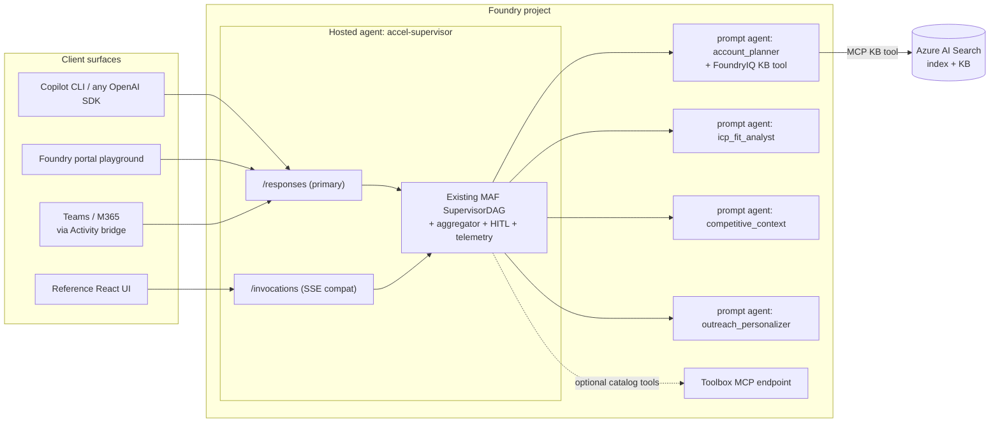

# Modernization Plan — Foundry Hosted Agents + Skills-First Delivery

> **Audience:** the AI coding agent (or engineer) executing this plan. It is self-contained: every
> decision, file-level change, and acceptance gate is stated here. Where platform facts may have
> drifted since authoring (2026-07-20), a **VERIFY** step says exactly what to re-check before
> depending on it. Execute phases in order; each phase leaves the repo shippable.
>
> **Authored:** 2026-07-20 · **Repo baseline:** commit `656bbfc` on `main` · **Owner:** Joe Langley

---

## 1. Goal

Re-platform this accelerator so that:

1. **The default deployment target is Foundry Hosted Agents** (GA July 2026) — the flagship
   scenario deploys into Foundry Agent Service with `azd provision` + `azd deploy` in **code
   deploy mode** (zip upload, remote build). No Docker on the partner's machine, no ACA, no
   partner-managed ACR, no workload managed identity, no GitHub Environment/OIDC on day 1.
2. **The delivery motion is a backend skill for GitHub Copilot CLI** (and any Agent Skills host:
   VS Code, Copilot cloud agent, Claude Code). Every stage — discover → scaffold → deploy →
   evaluate → handover — is drivable from a terminal coding agent via `.github/skills/*/SKILL.md`
   wrapping deterministic Python CLIs. The existing `.github/agents/*.agent.md` custom agents stay
   as the guided-persona layer on top.
3. **The vNet-based deployment becomes an optional add-on module named "MVP Deployment"**
   (`addons/mvp-deployment/`). It contains everything private-networking related: network-isolated
   hosted agents (private Foundry + BYO vNet egress) and the current self-hosted Container Apps
   path (the full existing infra, preserved for customers who mandate compute in their own
   subscription). The default path never mentions vNets.

**Non-goals:** changing the flagship scenario's business logic, the three-layer agent module shape
(ADR-0007), the HITL/telemetry/killswitch/evals primitives in `src/accelerator_baseline/`, the
discovery kit, or the `accelerator.yaml`-as-manifest philosophy. Workers remain Foundry **prompt
agents** authored in `docs/agent-specs/*.md`.

---

## 2. Why (friction analysis of the current architecture)

Current deploy path (`azd up`, ~15 min best case, many first-run failure modes):

```
gh template clone → VS Code + Copilot Chat → /configure-landing-zone → /deploy-to-env
  (GitHub Environment + OIDC federated credential — "#1 cause of first-deploy failures")
→ azd up:
    Bicep: Foundry acct + project + models + RAI + AI Search + Key Vault + ACR
           + Container Apps env + Container App + Log Analytics + App Insights
           + workload user-assigned MI + ~8 role assignments (incl. ABAC-conditioned
           RBAC-admin so the container can grant per-agent Search roles at runtime)
    → remote ACR image build of src/Dockerfile
    → container boots → src/bootstrap.py runs INSIDE the FastAPI lifespan with a
      10-minute retry budget absorbing RBAC propagation lag
    → ACA startup probe green = deploy success
```

What Hosted Agents (GA) eliminates:

| Current component | Why it exists today | Hosted-agents replacement |
|---|---|---|
| Container App + managed env + ingress + SSE keep-alive plumbing | Something must run the Python supervisor DAG | Foundry-managed per-session sandbox; protocol library serves HTTP; platform manages streaming/conversations |
| ACR + Dockerfile + remote build | ACA needs an image | **Code deploy mode**: zip source, platform builds (`remote_build`) |
| Workload user-assigned MI + role-assignment web | Container needs identity for Foundry/Search | **Entra Agent ID** auto-provisioned per agent at deploy time |
| ABAC-constrained RBAC-admin grant + `azure-mgmt-authorization` at runtime | Headless in-container bootstrap must grant per-agent Search RBAC | Provisioning moves to deploy time under the operator's own identity (or CI's OIDC SP) |
| Bootstrap-in-lifespan with retry budget | Only place code runs post-provision | Explicit deploy-time provisioner step (azd hook / skill step) |
| Key Vault (default path) | Baseline posture; barely used (no keys anywhere) | Dropped from default path; add-on keeps it; Foundry connections cover secret refs |
| App Insights wiring code | Manual OTel config | Platform injects `APPLICATIONINSIGHTS_CONNECTION_STRING`; protocol libs emit OTel by default |
| GitHub Environment + OIDC before first deploy | CI-first deploy contract | Day-1 deploy is local `azd`; CI/OIDC becomes the *productionization* step, not the entry fee |
| Killswitch = env var + revision ops | ACA revision model | Immutable agent **versions** + weighted traffic routing (blue/green, instant rollback) |

Also gained for free: portal **agent playground** per deployed agent, session state (`$HOME` +
`/files`), scale-to-zero consumption billing, optional Teams/M365 publishing via the Activity
bridge, A2A protocol for future agent-to-agent composition.

---

## 3. Verified platform facts (as of 2026-07-20) + how to re-verify

All of these were confirmed against live docs on 2026-07-20. Re-verify the **VERIFY** items in
Phase 0 before writing code — extension names and preview details churn.

1. **Hosted agents are GA (July 2026)** in ~29 regions. Concepts:
   <https://learn.microsoft.com/en-us/azure/foundry/agents/concepts/hosted-agents>
   - Containerized agent apps on Foundry Agent Service; any framework (Agent Framework, LangGraph,
     custom). Python + C#.
   - Per-session VM-isolated sandboxes, persistent `$HOME` + `/files`, 15-min idle timeout,
     scale-to-zero, per-session CPU/memory sizing (0.5/1/2 vCPU tiers), consumption billing.
   - **Protocols:** `responses` (OpenAI-compatible `/responses`; platform-managed conversation
     history, streaming, `background: true`), `invocations` (arbitrary JSON + raw SSE — explicitly
     recommended for "protocol bridge (GitHub Copilot, proprietary systems)" and custom streaming),
     `invocations_ws` (WebSocket), `a2a` (preview), Activity bridging for Teams/M365. Multiple
     protocols can coexist on one agent.
   - **Identity:** dedicated Microsoft Entra ID ("agent identity") auto-created at deploy; project
     system MI handles infra ops (e.g., ACR pull). Grant the agent identity RBAC manually for
     external resources (we need this for AI Search).
   - **Tools:** direct tool attachment to hosted-agent definitions is NOT supported — Foundry-managed
     tools are reached through the project's **Toolbox MCP endpoint**; agent code connects as an MCP
     client. (Our in-code tools — CRM write, send email — are unaffected; they're just Python.)
   - **Versioning:** each version is immutable (image/code + env vars + protocols + resources);
     weighted traffic split across versions.
   - **Observability:** platform injects App Insights connection string; protocol libraries emit
     OpenTelemetry automatically.
   - **Private networking:** supported for network-isolated Foundry + customer-provided vNet for
     outbound; projects created after 2026-06-25 support private ACR. (→ our MVP Deployment add-on.)
2. **azd flow** — Quickstart:
   <https://learn.microsoft.com/en-us/azure/foundry/agents/quickstarts/quickstart-hosted-agent>
   - `azd ext install microsoft.foundry` (July 2026 quickstart) — older docs say
     `azd ext install azure.ai.agents`. **VERIFY** the current extension id with `azd ext list`
     after install; troubleshooting docs reference `azd ext upgrade azure.ai.agents` ≥
     `0.1.34-preview`. Requires azd ≥ 1.25.3.
   - Commands: `azd ai agent init -m <azure.yaml url/path> --deploy-mode code` · `azd provision` ·
     `azd ai agent run` (local, port 8088, opens agent inspector) · `azd deploy` ·
     `azd ai agent invoke "<prompt>"` · `azd ai agent monitor --follow` · `azd down`.
   - `azd provision` for a hosted agent creates: RG + Foundry account + project + model deployment
     + App Insights + container registry. The agent definition lives in `azure.yaml` as an
     `azure.ai.agent` service (protocol versions declared there). **VERIFY** exact `azure.yaml`
     schema by running `azd ai agent init` against the basic sample and capturing the generated
     file (Phase 0).
   - SDK path (no azd): `azure-ai-projects>=2.3.0` →
     `project_client.agents.create_version_from_code(..., definition=HostedAgentDefinition(cpu,
     memory, code_configuration=CodeConfiguration(runtime="python_3_14", entry_point=[...],
     dependency_resolution=CodeDependencyResolution.REMOTE_BUILD), environment_variables={...},
     protocol_versions=[ProtocolVersionRecord(protocol="responses", version="2.0.0")]), code=zip)`,
     then `agents.update_details(agent_endpoint=AgentEndpointConfig(version_selector=...))` for
     traffic routing, and `project_client.get_openai_client(agent_name=...)` for invocation.
3. **Agent Framework hosting integration** —
   <https://learn.microsoft.com/en-us/agent-framework/hosting/foundry-hosted-agent>
   - `pip install agent-framework agent-framework-foundry-hosting`.
   - `ResponsesHostServer(agent)` / `InvocationsHostServer(agent)` wrap an Agent Framework `Agent`
     or workflow; `InvocationAgentServerHost` (from `azure.ai.agentserver.invocations`) gives a raw
     `@app.invoke_handler` for full HTTP/SSE control — Starlette `Request` in,
     `StreamingResponse` out, with `request.state.session_id` provided. This is the shape our
     existing SSE contract maps onto.
   - Platform-injected env vars: `FOUNDRY_PROJECT_ENDPOINT`, `AZURE_AI_MODEL_DEPLOYMENT_NAME`,
     `APPLICATIONINSIGHTS_CONNECTION_STRING`.
   - **VERIFY** package GA status/pins on PyPI: `agent-framework-foundry-hosting`,
     `azure-ai-agentserver-*`; update `ga-versions.yaml` accordingly (the repo's GA-only rule).
4. **Agent Skills is an open standard** across Copilot CLI, VS Code, Copilot cloud agent (and
   Claude Code): project locations `.github/skills/`, `.claude/skills/`, `.agents/skills/`;
   `SKILL.md` with `name` + `description` frontmatter (optional `license`, `allowed-tools`);
   bundled scripts/assets in the skill folder are auto-discovered; explicit invocation via
   `/<skill-name>` in Copilot CLI.
   <https://docs.github.com/en/copilot/how-tos/copilot-cli/customize-copilot/add-skills>
5. **The Microsoft Foundry Skill already exists** and drives hosted-agent workflows from coding
   agents (install: `/plugin marketplace add microsoft/azure-skills` + `/plugin install
   azure@azure-skills` in Copilot CLI; `npx skills add https://github.com/microsoft/azure-skills
   --skill microsoft-foundry` for skill-only). It reads workspace conventions we should adopt for
   interop: `azure.yaml`, `.azure/<env>/.env`, `.foundry/agent-metadata.yaml`, `eval.yaml`.
   <https://learn.microsoft.com/en-us/azure/foundry/how-to/develop/use-microsoft-foundry-skill>
6. **Build 2026 additions:** direct code deployment (zip + `remote_build` or `bundled`), built-in
   Content Safety guardrails for hosted agents, Voice Live/WebSocket, Agent Optimizer (private
   preview). <https://devblogs.microsoft.com/foundry/hosted-agents-build26/>

---

## 4. Target architecture

### 4.1 Runtime



- The **supervisor DAG code is preserved verbatim** (`src/workflow/supervisor.py`,
  `src/scenarios/*/workflow.py`, three-layer agent modules, HITL, telemetry, killswitch,
  citations). Only the serving shell changes: FastAPI/uvicorn/ACA → the Foundry hosting protocol
  libraries.
- **Workers stay declarative Foundry prompt agents** (specs in `docs/agent-specs/`, versioned,
  portal-visible) — unchanged. ADR-0002 intact.
- **Two protocols on the one hosted agent**:
  - `responses` — primary. OpenAI-compatible; gives portal playground, any-SDK clients,
    `background: true` for long runs, Teams/M365 publishing. Map briefing progress to Responses
    streaming events; final briefing JSON is the response output.
  - `invocations` — compatibility. Reuse the exact current SSE event vocabulary
    (`status`/`worker_started`/`chunk`/`partial`/`briefing_ready`/`tool_*`/`final`/`done` + `seq`)
    so `patterns/sales-research-frontend/` and any partner UI keep working with a URL change only.
- **Why not declarative Foundry Workflows instead of hosted code?** The DAG's semantics —
  per-worker validation retries, transitive skip propagation, deterministic aggregation, HITL
  gating, typed telemetry — are code-shaped and battle-tested here. Hosting the existing code is
  the lowest-risk path that still deletes all infra. Revisit declarative workflows as a future
  simplification for the `single-agent`/`chat-with-actioning` variants; note it in the ADR.

### 4.2 Provision + deploy (default path)

```
azd provision      # slim Bicep: Foundry acct + project + models (from accelerator.yaml models:)
                   #   + RAI policy + AI Search (conditional on scenario.retrieval) + connections
                   #   + App Insights (+ azd-managed registry for the hosted agent service)
azd deploy         # zips src/, uploads, remote build, creates immutable agent version,
                   #   routes 100% traffic (first deploy)
scripts/foundry-provision.py   # deploy-time provisioner (ex-bootstrap): prompt agents from specs,
                   # KB/knowledge sources, index schema + seeding + embeddings, per-agent Search
                   # RBAC — runs under the operator's identity (azd postdeploy hook + skill step)
azd ai agent invoke "<smoke prompt>"   # smoke test; playground URL printed by azd deploy
```

No Key Vault, no ACA, no workload MI, no OIDC, no Docker on the default path.

### 4.3 Skills surface (the "backend skill for GHCP CLI")

`.github/skills/` (auto-discovered by Copilot CLI, VS Code, Copilot cloud agent; mirrored for
Claude Code via `.claude/skills` symlink or duplicate — see Phase 4):

| Skill | Wraps | Purpose |
|---|---|---|
| `accel-engage` | `gh repo create --template` + repo orientation | Start a customer engagement from a terminal: clone, name, open checklist |
| `accel-discover` | `docs/discovery/*` + `scripts/extract-brief-from-doc.py` | Run/resume discovery; PRD ingest branch; writes `solution-brief.md` |
| `accel-scaffold` | `scripts/scaffold-scenario.py`, `scripts/scaffold-agent.py` | Materialize scenario/worker from the brief; paste manifest snippets |
| `accel-deploy` | `azd` + `scripts/foundry-provision.py` + `scripts/preflight-deploy.py` | Preflight (auth, quota, region supports hosted agents) → provision → deploy → provision agents → smoke invoke; prints playground + endpoint |
| `accel-evaluate` | `evals/quality/run.py`, `evals/redteam/run.py`, `scripts/enforce-acceptance.py`, `eval.yaml` | Baseline + acceptance gates against the deployed agent endpoint |
| `accel-iterate` | `azd deploy` + version routing helpers | New version, canary %, promote/rollback |
| `accel-handover` | new `scripts/build-handover-packet.py` | Generate the engagement handover packet from azd env + endpoints + eval baseline |
| `accel-mvp-deployment` | `addons/mvp-deployment/` | The vNet add-on: guided choice between private-hosted and self-hosted flavors |

Rules:
- Every skill is a **thin instruction layer over a deterministic CLI** — no logic lives only in
  markdown. Anything a skill can do, a human can do by running the same commands (documented in
  each SKILL.md).
- Existing `.github/agents/*.agent.md` custom agents are updated to *reference* the skills for
  mechanics and keep only conversation flow (they already work in Copilot CLI as custom agents).
- Recommend (in docs) installing the **Azure Skills Plugin** alongside, for generic Foundry ops
  (quota, RBAC, model deployment, tracing) — our skills own only accelerator-specific flows and
  defer generic ones to `microsoft-foundry`.
- Adopt Foundry Skill workspace conventions (`eval.yaml`, `.foundry/agent-metadata.yaml`) so
  Microsoft's skill can operate this repo natively.

### 4.4 MVP Deployment add-on (vNet)

`addons/mvp-deployment/` — everything private-networking, out of the default path:

- **Flavor A — private hosted agents (recommended):** network-isolated Foundry account +
  customer-provided vNet for agent egress + private ACR (projects created ≥ 2026-06-25) + private
  endpoints for AI Search. Partner stays on the hosted runtime; only networking changes.
  **VERIFY** during Phase 3 against
  <https://learn.microsoft.com/en-us/azure/foundry/agents/how-to/virtual-networks>.
- **Flavor B — self-hosted (current architecture, preserved):** the existing ACA + ACR + workload
  MI + Key Vault + FastAPI serving stack, relocated wholesale, for customers who mandate compute
  in their own subscription or need the ALZ hub-spoke integration as-is. Contains today's
  `infra/alz-overlay/`, `infra/avm-reference/`, `main.parameters.alz.json`, `container-app.bicep`,
  `identity.bicep`, `key-vault.bicep`, `acr.bicep`, `src/Dockerfile`, `src/main.py` (FastAPI
  entrypoint), and the landing-zone tier docs (avm / alz-integrated).
- Manifest: `accelerator.yaml` gains a `deployment:` block; `landing_zone:` moves under it and is
  only consulted by the add-on.

```yaml
deployment:
  target: hosted            # hosted (default) | mvp-private-hosted | mvp-self-hosted
  # landing_zone: only read when target != hosted; same tier semantics as today
```

### 4.5 UX design — partner and customer handoff

**Partner journey (target, all from Copilot CLI or VS Code):**

1. `copilot` → "Start a new engagement for Contoso" → `accel-engage` clones the template,
   prints the 7-stage checklist with current stage.
2. `/accel-discover` — the interview (live / from notes / PRD ingest) fills the brief. Identical
   in CLI and VS Code.
3. `/accel-scaffold` — scenario materialized; lint explains any gaps.
4. `/accel-deploy dev` — preflight → `azd provision` → `azd deploy` → agent provisioning → smoke
   invoke. Ends by printing: **agent endpoint**, **portal playground URL**, **traces URL**, and
   "share the playground link with your customer sponsor today."
   Target wall-clock ≤ 8 min; zero Docker, zero OIDC, zero portal clicks.
5. Iterate: edit specs/code → `/accel-iterate` → new immutable version → `/accel-evaluate` →
   canary 10% → promote. CI (GitHub Environments + OIDC via `/deploy-to-env`) is introduced
   **here**, as productionization, not as a prerequisite.
6. `/accel-handover` — generates the packet: endpoints, playground + observability + evals portal
   links, HITL approver rota, version-rollback runbook (portal traffic-split screenshot), cost
   view, killswitch drill.

**Customer-facing surfaces at handoff (the "wow" deltas vs today):**

- **Foundry portal is the customer's control plane** — playground to try the agent immediately,
  conversation traces, eval runs, content-safety config, per-version traffic routing for instant
  rollback, consumption cost. Today's handoff hands over an ACA FQDN + App Insights workbook;
  the new handoff hands over a product surface.
- **Demo-ready from minute one:** the sponsor can chat with the deployed agent in the playground
  during UAT without any UI work.
- **Optional Teams/M365 publish** via the Responses→Activity bridge — "your agent inside Teams"
  becomes a checkbox-scale step, not an integration project. Position as an upsell in Stage 6.
- **Reference React UI** continues to work against the `invocations` endpoint (URL swap only).
- **Integration snippet** in the packet: 5-line OpenAI-SDK call to the `responses` endpoint for
  the customer's own portal team.
- **Day-2 simplifications:** killswitch = route traffic to 0%/maintenance version (portal action);
  no key rotation (no keys exist); model swap stays `accelerator.yaml` + `azd provision`.

---

## 5. Execution phases

> Conventions for the executing agent: work on a branch per phase
> (`feat/hosted-agents-phase-<n>`), keep `python scripts/accelerator-lint.py` and `pytest` green at
> every merge, update docs in the same PR as the code they describe. Where a step says VERIFY,
> record the outcome in the PR description and in `docs/version-matrix.md`.

### Phase 0 — Platform verification spike (no repo changes except pins/docs)

**Objective:** pin down the moving parts before refactoring.

1. Install tooling: azd ≥ 1.25.3; `azd ext install microsoft.foundry` (fall back to
   `azure.ai.agents` if renamed); record exact extension id + version from `azd ext list`.
2. In a scratch directory (NOT this repo), run the quickstart end-to-end with
   `azd ai agent init -m https://github.com/microsoft-foundry/foundry-samples/blob/main/samples/python/hosted-agents/agent-framework/responses/01-basic/azure.yaml --deploy-mode code`
   → `azd provision` → `azd ai agent run` → `azd deploy` → `azd ai agent invoke`. Capture:
   - the generated `azure.yaml` (the `azure.ai.agent` service schema — host type, protocol
     versions, deploy-mode, startupCommand),
   - what `azd provision` actually creates (resource list),
   - the injected env vars observed in the container.
3. Repeat locally for the **invocations** sample
   (`samples/python/hosted-agents/agent-framework/` in
   <https://github.com/microsoft-foundry/foundry-samples>) — confirm dual-protocol declaration and
   the `InvocationAgentServerHost` streaming shape (SSE passthrough, `request.state.session_id`).
4. Pin SDKs: resolve current GA versions on PyPI for `agent-framework`,
   `agent-framework-foundry-hosting`, `azure-ai-agentserver-invocations` (or its current package
   name), `azure-ai-projects` (≥ 2.3.0 needed for `HostedAgentDefinition`/
   `create_version_from_code`). Update `ga-versions.yaml` + `docs/version-matrix.md`. If a needed
   package is preview-only, add an explicit allow-list entry mirroring the existing
   `infra/.ga-exceptions.yaml` mechanism (create `ga-exceptions` support in `ga-versions.yaml` —
   lint change in Phase 5).
5. Confirm hosted-agents **region list** covers the regions in `docs/getting-started` guidance;
   note the list in `scripts/preflight-deploy.py` data (implemented Phase 2).
6. Confirm streaming behavior end-to-end through the deployed `invocations` endpoint (SSE chunks
   arrive incrementally, not buffered) and measure cold-start (first request after idle) — record
   both in the PR; if cold-start > 30 s it must be called out in `accel-deploy` skill output and
   the acceptance `p95_latency_ms` guidance.
7. Confirm hosted-agent egress can reach: the Foundry project endpoint (worker prompt-agent
   invocation), AI Search data plane (KB MCP + seeding path), and ARM (NOT required at runtime
   anymore — RBAC grants move to deploy time; verify nothing else in `src/` calls ARM at runtime).

**Acceptance:** a written spike report in `docs/plans/phase0-spike-report.md` with the captured
`azure.yaml`, resource inventory, package pins, cold-start numbers, and any deviations from this
plan's assumptions (each deviation gets a proposed adjustment).

### Phase 1 — Hosted-agent runtime

**Objective:** the flagship runs as a hosted agent locally (`azd ai agent run`) with both
protocols, with zero behavior change to workflow semantics.

File-level changes:

1. **New entrypoint `src/agent_host.py`** (replaces `src/main.py` on the default path — do not
   delete `main.py` yet; it moves to the add-on in Phase 3):
   - Load scenario via existing `src.workflow.registry.load_scenario()` (unchanged).
   - **Invocations protocol:** `InvocationAgentServerHost` with an `@app.invoke_handler` that
     replicates the current `/research/stream` contract from `src/main.py::_make_stream_endpoint`:
     pydantic-validate against `bundle.request_schema`, drive `bundle.workflow.stream(payload)`,
     emit the same SSE event vocabulary with monotonic `seq` and terminal `done`, heartbeat
     comments preserved. Port the code, don't rewrite it — extract the generator body from
     `main.py` into a shared module (`src/serving/sse.py`) both entrypoints use.
   - **Responses protocol:** wrap the same workflow as the primary surface. Input mapping: accept
     the research request either as structured JSON in the input text (documented) or as free text
     the supervisor schema-fills (implement `ResearchRequest.from_text()` minimal parser:
     `company_name` required, rest optional). Progress events map to Responses streaming events;
     the final briefing serializes as the response text (JSON). Long runs: document
     `background: true` usage in the packet.
   - CORS/`ALLOWED_ORIGINS` handling carries over for the invocations endpoint only if the
     protocol library exposes middleware hooks; otherwise document that browser clients call
     through the platform endpoint (which handles auth) — resolve in Phase 0 spike, item 3.
2. **Extract bootstrap → deploy-time provisioner `scripts/foundry-provision.py`:**
   - Move the logic of `src/bootstrap.py` (`_bootstrap_search`, `_bootstrap_knowledge`,
     `_bootstrap_foundry`, `_canary_query`, `_grant_agent_search_access`) into an idempotent CLI:
     `python scripts/foundry-provision.py [--env <azd-env>] [--canary] [--skip-seed]`.
     Reads config from `.azure/<env>/.env` (azd outputs) with explicit env-var fallbacks
     (same names as today). Exit non-zero on failure with the same retry budget.
   - Delete the runtime RBAC-admin dependency: per-agent Search role grants now run under the
     operator identity. Remove `azure-mgmt-authorization` from **runtime** deps (keep available to
     the script; move to a new `[project.optional-dependencies] provision` extra together with
     `azure-mgmt-cognitiveservices` if unused at runtime).
   - `src/bootstrap.py` becomes a thin shim that (a) no-ops with a log line when
     `HOSTED_AGENT=1`/platform env detected, (b) still works for the add-on's FastAPI path.
     `BOOTSTRAP_SKIP` semantics preserved for tests.
   - Register as azd **postdeploy hook** in `azure.yaml` so `azd deploy` remains one command, and
     as an explicit step in the `accel-deploy` skill.
3. **`src/scenarios/sales_research/workflow.py`:** no semantic changes. Verify `FoundryAgent`
   env expectations: accept `FOUNDRY_PROJECT_ENDPOINT` (platform-injected) as an alias for
   `AZURE_AI_FOUNDRY_ENDPOINT` — add the alias resolution in `src/config/settings.py` and
   everywhere `os.environ.get("AZURE_AI_FOUNDRY_ENDPOINT")` is read (grep: `bootstrap.py`,
   `workflow.py`, `retrieval/ai_search.py`, settings). One helper:
   `src/config/settings.py::foundry_project_endpoint()`.
4. **Telemetry:** `azure-monitor-opentelemetry` config in the new entrypoint only if the protocol
   library doesn't already own OTel setup (Phase 0 finding); ensure `emit_event` spans still
   correlate (the protocol libs create request spans — confirm parent-span correlation in spike).
   Remove `opentelemetry-instrumentation-fastapi` from default-path deps (moves to add-on).
5. **Dependencies (`pyproject.toml`):** add `agent-framework-foundry-hosting` + the agentserver
   package (pins from Phase 0). Move `fastapi`, `uvicorn`, `opentelemetry-instrumentation-fastapi`
   to a `selfhost` extra (used by the add-on). Update `ga-versions.yaml` in lockstep.
6. **Tests:** keep all existing unit tests green (`BOOTSTRAP_SKIP=1` paths unchanged). Add:
   - `tests/test_agent_host_invocations.py` — request validation, SSE event sequence + `seq`
     monotonicity + terminal `done`, error → in-band `error` event (port the assertions that exist
     for `main.py` if present; else write them fresh against the shared `src/serving/sse.py`).
   - `tests/test_provision_cli.py` — provisioner arg parsing + idempotency guards with mocked
     clients (reuse existing bootstrap test doubles if present in `tests/`).

**Acceptance:**
- `azd ai agent run` serves locally; `curl POST /invocations` streams the flagship SSE contract
  with `BOOTSTRAP_SKIP=1` + stub agents (no Azure needed), and against a real project with agents
  provisioned.
- `pytest` green; `python scripts/accelerator-lint.py` green (lint updates land in Phase 5 — if a
  rule hard-fails on the interim state, mark it with an inline waiver comment and fix in Phase 5,
  noting it in the PR).

### Phase 2 — Infra slim-down + azd flow

**Objective:** `azd provision && azd deploy` is the entire default deployment.

1. **`azure.yaml` rewrite:** replace the `api` containerapp service with the hosted-agent service
   per the Phase 0 captured schema (`azure.ai.agent` host, `deploy-mode: code`, protocols
   `responses` + `invocations`, startupCommand `python -m src.agent_host`, entry point + runtime
   pinned to the Phase 0-verified Python runtime). Add the `foundry-provision` postdeploy hook.
2. **`infra/main.bicep` slim-down (default path):**
   - Keep: `modules/foundry.bicep` (account, project, RAI policy, default + extra model
     deployments from `loadYamlContent('accelerator.yaml')`, embedding deployment),
     `modules/ai-search.bicep` (conditional: only when the manifest declares
     `scenario.retrieval.indexes`), `modules/monitor.bicep`, the Search↔Foundry connections +
     role assignments blocks (project→Search reader, Search→AOAI user, `CognitiveSearch` + KB
     `RemoteTool` MCP connections).
   - Remove from default path: `modules/container-app.bicep`, `modules/identity.bicep`,
     `modules/key-vault.bicep`, `modules/acr.bicep` (azd's hosted-agent flow manages the registry
     — confirm in Phase 0; if azd expects a registry parameter, keep `acr.bicep` but mark it
     azd-internal), the `workloadAssignsSearchRoles` ABAC assignment, `enablePrivateLink` /
     `peSubnetId` / `privateDnsZoneIds` / `externalIngress` parameters and the tier-3 guard
     (all move to the add-on in Phase 3).
   - Keep outputs needed by the provisioner + evals: `AZURE_AI_FOUNDRY_ENDPOINT`,
     `AZURE_AI_FOUNDRY_MODEL(_MAP)`, `AZURE_AI_SEARCH_*`, KB names, App Insights connection
     string. Drop `API_URL` (agent endpoint comes from `azd deploy` output; have the
     provisioner/skill echo it).
   - Operator RBAC: add a parameter `operatorPrincipalId` (defaulted from `azd`'s
     `principalId`) granted `Azure AI Developer` + Search data roles so the deploy-time
     provisioner works under the operator identity in fresh subscriptions.
3. **`scripts/preflight-deploy.py`:** extend with hosted-agents checks — azd + extension
   installed/version, region in hosted-agents list, model quota, `az`/`azd` auth, Python version.
   Keep existing checks that still apply; delete ACA/ACR checks (move to add-on preflight).
4. **CI (`.github/workflows/deploy.yml`):** swap the deploy job's `azd up` for
   `azd provision` + `azd deploy` + `python scripts/foundry-provision.py`; post-deploy evals now
   read the agent endpoint from azd env instead of `API_URL`. `deploy/environments.yaml` contract
   unchanged. OIDC SP additionally needs `Azure AI Developer` on the project (document in
   `/deploy-to-env` agent file).
5. **Teardown:** update `scripts/teardown-preflight.py` + `/teardown` agent for the new resource
   inventory (`azd down` covers it; hosted agent versions die with the project).

**Acceptance:** in a clean subscription: `azd provision` (≤ ~8 min) → `azd deploy` → provisioner →
`azd ai agent invoke` returns a grounded briefing; `evals/quality/run.py --api-url <invocations
endpoint>` passes thresholds; no ACA/ACR/KV/MI resources exist in the RG (registry exempt if azd
requires it); `azd down` cleans up.

### Phase 3 — MVP Deployment add-on (vNet)

**Objective:** relocate — don't rewrite — the private-networking and self-hosted paths.

1. Create `addons/mvp-deployment/` with:
   - `README.md` — decision guide: Flavor A (private hosted) vs Flavor B (self-hosted); when the
     customer's requirement actually needs which; explicit statement that the default public path
     is the recommended start and this add-on is opt-in.
   - `flavor-a-private-hosted/` — Bicep params/modules for network-isolated Foundry + BYO vNet
     egress + private ACR + Search private endpoints, per the hosted-agents virtual-networks doc
     (**VERIFY** exact resource shapes at execution; this flavor is NEW build, small surface).
   - `flavor-b-self-hosted/` — moved wholesale: `infra/modules/container-app.bicep`,
     `identity.bicep`, `key-vault.bicep`, `acr.bicep`, `infra/alz-overlay/`,
     `infra/avm-reference/`, `infra/main.parameters.alz.json`, `src/Dockerfile`, `src/main.py`
     (FastAPI entrypoint + its SSE code path re-using `src/serving/sse.py`), plus a
     `main.bicep` that composes the old full stack. Keep the landing-zone tier docs
     (`docs/patterns/azure-ai-landing-zone/README.md`) but retitle the tiers as configurations of
     this add-on.
2. `accelerator.yaml`: add the `deployment:` block (§4.4); move `landing_zone:` under it.
   Default `target: hosted`.
3. `/configure-landing-zone` custom agent → renamed/refocused as the entry to
   `accel-mvp-deployment`; it now first asks "does this engagement actually need private
   networking?" and routes back to the default path when not.
4. Lint: `landing_zone_mode_consistent` becomes `deployment_target_consistent` — asserts
   `deployment.target` matches which infra folder is active (Phase 5 implements; stub the rename
   here).

**Acceptance:** default-path repo has zero vNet/PE/ACA references outside `addons/`; Flavor B
deploys the old stack end-to-end from `addons/mvp-deployment/flavor-b-self-hosted/` (smoke: the
old `azd up` flow with adjusted paths); docs decision guide reviewed.

### Phase 4 — Skills surface

**Objective:** the delivery motion works headless in Copilot CLI (and Claude Code / VS Code).

1. Create `.github/skills/<name>/SKILL.md` for the eight skills in §4.3. Frontmatter:
   `name`, `description` (rich, trigger-oriented — the router reads it), optional `allowed-tools`
   for the wrapped scripts (e.g. pre-approve `python scripts/foundry-provision.py`, `azd deploy`).
   Body sections per skill: *When to use · Inputs to gather · Steps (exact commands) · Success
   output to show the user · Failure triage table (symptom → fix, seeded from
   `docs/references/troubleshooting.md`)*.
2. New deterministic CLIs the skills need:
   - `scripts/build-handover-packet.py` — renders `docs/handover/handover-packet-template.md`
     with azd env values, endpoints, portal deep links, eval baseline (reads `baseline.txt` /
     evals output), HITL config. Output: `docs/handover/<env>-handover.md`.
   - `scripts/agent-traffic.py` — list versions, set weighted routing (canary/promote/rollback,
     killswitch-to-zero) via `azure-ai-projects` `update_details`/`AgentEndpointConfig`.
3. `eval.yaml` at repo root mapping the manifest's acceptance thresholds + datasets to the Foundry
   Skill's convention (dataset file, evaluators, pass threshold) so `microsoft-foundry`'s eval
   workflows run against this repo. Generate it from `accelerator.yaml` (extend
   `scripts/enforce-acceptance.py` with `--emit-eval-yaml` and check drift in lint).
4. `.claude/skills` compatibility: Copilot CLI already reads `.claude/skills`; Claude Code reads
   `.claude/skills`. Author once under `.github/skills/` and add a documented
   one-line sync (`scripts/sync-skills.py` copying `.github/skills` → `.claude/skills`, run in CI
   pages job) — **VERIFY** first whether the target hosts now read `.github/skills` directly
   (Claude Code roadmap may have added it); if so, skip the mirror.
5. Update `.github/agents/*.agent.md`: each custom agent's mechanical steps collapse to "invoke
   skill X"; conversation/persona content stays. `deploy-to-env` gets the new CI story (OIDC as
   productionization). `AGENTS.md` + `copilot-instructions.md`: document the skills surface, the
   hosted-first rules (new MUST: "default deployment target is hosted agents; never reintroduce
   self-host resources outside `addons/`"), and note that Copilot CLI is a first-class surface.
6. Smoke-test matrix (manual, documented in PR): each skill invoked from (a) Copilot CLI
   `/skill-name`, (b) VS Code Copilot chat, (c) Claude Code, against a sandbox subscription.

**Acceptance:** a fresh terminal with only `copilot`, `az`, `azd`, `gh`, `python` installed can run
engage → discover (from notes) → scaffold → deploy → evaluate → handover without opening VS Code
or the Azure portal; each skill's failure-triage table covers the top 3 failure modes observed in
testing.

### Phase 5 — Evals, CI, lint alignment

1. **Eval runners:** `evals/_runner_common.py` gets an endpoint adapter — targets the hosted
   agent's `invocations` endpoint (same SSE contract) with `DefaultAzureCredential` bearer auth
   (**VERIFY** auth header expectations for agent endpoints in Phase 0); `--api-url` semantics
   preserved. Post-deploy regression in `deploy.yml` reads the endpoint from azd env.
2. **Lint (`scripts/accelerator-lint.py`) updates:**
   - Retire/rescope to add-on: ACA/ingress checks, `landing_zone_mode_consistent` (→
     `deployment_target_consistent`), Key Vault presence on default path.
   - New rules: `hosted_agent_service_declared` (azure.yaml has the agent service with both
     protocols), `provisioner_hooked` (postdeploy hook present), `no_selfhost_outside_addon`
     (no `Microsoft.App/` or Dockerfile references outside `addons/`), `skills_wrap_scripts`
     (every SKILL.md references at least one repo script; no orphan skills),
     `eval_yaml_in_sync` (eval.yaml matches accelerator.yaml acceptance).
   - Keep all identity/HITL/telemetry/RAI rules unchanged.
3. **CI:** `lint.yml` + `evals.yml` unchanged in spirit; `version-matrix.yml` adds the new
   hosting packages to the weekly freshness check; `pages.yml` publishes the updated docs.
4. **`ga-versions.yaml`:** final pins from Phases 0–2, with the preview-exception mechanism if any
   hosting package is still preview.

**Acceptance:** full CI green on the default path; a PR that adds an ACA resource to `infra/`
fails lint with `no_selfhost_outside_addon`.

### Phase 6 — Docs, ADRs, handoff UX polish

1. **New ADRs:** `0008-foundry-hosted-agents-default.md` (decision, consequences, the
   self-host escape hatch), `0009-skills-as-execution-surface.md`,
   `0010-mvp-deployment-addon.md`. Amend ADR-0003 (supervisor DAG now runs in a hosted agent —
   status note, not a rewrite); ADR-0002 unchanged (spec-file → prompt-agent sync survives, now at
   deploy time — update the mechanism sentence).
2. **README.md** — new stack line + adoption model (`copilot`/skills-first), "Under the hood" tree
   updated, MVP Deployment add-on called out.
3. **QUICKSTART.md** — rewrite as ~6 steps; Step "Preflight OIDC" demoted to the iterate stage;
   headline "deploy in ~8 minutes"; keep the printable-cheat-sheet framing.
4. **`docs/partner-workflow.md` + `partner-playbook.md`** — E2/EP nodes updated (no OIDC gate
   before provisioning; playground link at Stage 3; Teams publish option at Stage 6);
   customer-runbook rewritten for portal-based day-2 (traffic routing killswitch, no secret
   rotation, model swap unchanged).
5. **`docs/getting-started/setup-and-prereqs.md`** — new prereqs (azd extension, Copilot CLI
   optional), new troubleshooting (from Phase 0 findings + skill triage tables).
6. **`docs/enablement/hands-on-lab.md`** — Labs re-cut for the new flow (Lab: deploy via skill;
   Lab: canary + rollback; Lab: MVP add-on Flavor B for the enterprise module).
7. **Handover packet template** — add portal links section, integration snippet, Teams publish
   option, version-rollback runbook.

**Acceptance:** `mkdocs build` clean; doc-precedence chain still coherent (custom agents → skills
→ playbook → README); a reviewer can follow QUICKSTART cold and reach a deployed agent.

---

## 6. Risks & mitigations

| Risk | Impact | Mitigation |
|---|---|---|
| azd extension / `azure.yaml` schema churn (extension is `0.1.x`) | Phase 2 breakage | Phase 0 captures the live schema; pin extension version in docs + preflight check; SDK path (`create_version_from_code`) is the documented fallback in `foundry-provision.py --deploy` |
| Hosted-agent cold start (scale-to-zero, per-session sandbox) hurts the 4-worker fan-out latency baseline | Acceptance `p95_latency_ms` regressions | Measure in Phase 0; document warm-session behavior; `background: true` for long runs; keep `p95` threshold manifest-owned so partners tune per engagement |
| Per-session sandbox semantics vs. current stateless-API assumption | Session/conversation ID mishandling | Invocations path: treat each research request as a fresh session (client omits session reuse); Responses path: platform-managed — cover both in tests |
| Streaming buffering through the platform endpoint | UI regression | Phase 0 item 6 verifies SSE passthrough before any refactor lands |
| A required hosting package is preview-only (GA-only rule) | Lint conflict | Explicit exceptions mechanism (Phase 0 item 4 / Phase 5); mirror of existing `infra/.ga-exceptions.yaml` pattern |
| Agent-identity RBAC to AI Search (worker prompt agents) still needs the deploy-time grant | Retrieval 403s | Logic already exists (`_grant_agent_search_access`) — it moves, not changes; provisioner runs under operator identity; CI SP documented needs |
| Partners mid-engagement on the old shape | Upgrade pain | Old stack survives intact as MVP Flavor B; `accelerator_version` bump to `2.0.0`; migration note in CHANGELOG + README |
| Copilot CLI skills discovery quirks (`.github/skills` vs `.claude/skills`) | Skill invisibility | Phase 4 item 4 verify + sync script; manual smoke matrix across three hosts |

---

## 7. Decision log (already made — do not re-litigate during execution)

1. **Hosted agent hosts the existing MAF supervisor code; workers stay prompt agents.** Not
   declarative Foundry Workflows (v1) — semantics are code-shaped; revisit for variants later.
2. **Dual protocol** (`responses` primary, `invocations` compat) on one agent.
3. **Code deploy mode** (zip + remote build) default; image mode only in MVP Flavor B.
4. **Bootstrap becomes a deploy-time provisioner CLI** (+ azd postdeploy hook), not in-container.
5. **Key Vault, ACR, ACA, workload MI leave the default path** entirely.
6. **Skills wrap scripts; agents wrap skills.** No logic that exists only in markdown.
7. **The vNet add-on is named "MVP Deployment"** with Flavor A (private hosted) and Flavor B
   (self-hosted, = today's architecture preserved).
8. **`accelerator.yaml` remains the manifest**; it gains `deployment:` and keeps `models:` driving
   Bicep via `loadYamlContent` unchanged.
9. **Interop with the Microsoft Foundry Skill** via `eval.yaml` + `.foundry/agent-metadata.yaml`
   conventions rather than duplicating its generic Foundry workflows.

## 8. End-to-end acceptance checklist (run after Phase 6)

- [ ] Fresh clone, fresh subscription, terminal-only: engage → discover(from notes) → scaffold →
      `/accel-deploy dev` completes in ≤ 10 min wall-clock with playground URL printed.
- [ ] `azd ai agent invoke` returns a grounded briefing with ≥ 1 citation.
- [ ] `evals/quality` + `evals/redteam` + `scripts/enforce-acceptance.py` pass against the
      deployed endpoint; baseline captured.
- [ ] Reference React UI works against the invocations endpoint with only a URL change.
- [ ] Canary: deploy v2 at 10%, promote, roll back — all via `scripts/agent-traffic.py`.
- [ ] `/accel-handover` produces a packet with working portal deep links.
- [ ] MVP Flavor B deploys the legacy stack from `addons/mvp-deployment/`.
- [ ] `python scripts/accelerator-lint.py` = 0 findings; full CI green; `mkdocs build` clean.
- [ ] Skills invoke correctly from Copilot CLI, VS Code Copilot, and Claude Code.
