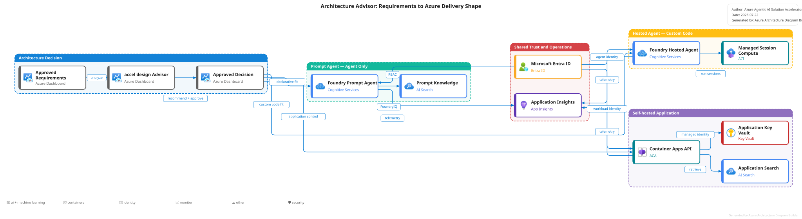
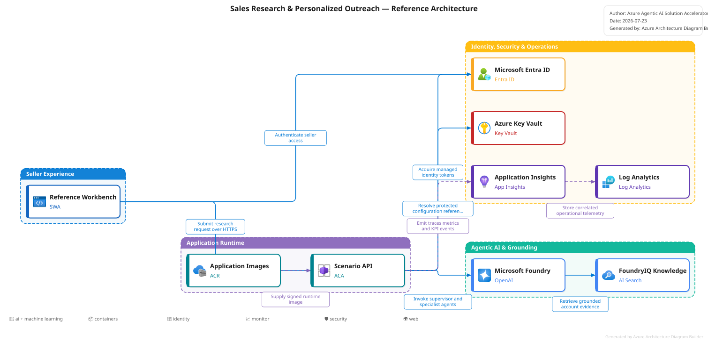

# Architecture patterns

What the accelerator ships today, and the shapes a partner can reasonably customise into.

---

## Choose the architecture before scaffolding

`accel design` evaluates approved requirements across five independent
dimensions: prompt versus Hosted agent, `managed-prompt` versus `harness`
versus `custom-workflow`, orchestration pattern, application shell, and
deployment target. Workflow is an orchestration pattern—not a third Foundry
Agent Service type.

| Implementation pattern | Use when |
|---|---|
| `managed-prompt` | Declarative, bounded prompt-agent scenarios using managed Foundry tools |
| `harness` | Adaptive Hosted single-agent work needing planning, todos, in-run history, and custom tools |
| `custom-workflow` | Deterministic sequences, retries, aggregation, or supervisor/worker DAGs |

<div class="architecture-diagram">
  
</div>

See the [Architecture Advisor](../../reference/architecture-advisor.md) for the
decision rules, approval/override flow, and prompt/Hosted target diagrams.

---

## Flagship self-host topology

**Pattern — supervisor routing, 4 specialists (grouped in 2 workstreams), retrieval-backed, HITL for side-effects.**

<div class="architecture-diagram">
  
</div>

The SVG was generated by Azure Architecture Diagram Builder MCP v1.0.0. Its
[provenance record](../../assets/diagrams/sales-research-reference.mcp.json)
contains the exact graph and WAF validation. The sample mirrors the default
`standalone` target, so the validation intentionally records single-region and
no-WAF findings rather than pretending those controls are already deployed.

Code pointers:

- Workflow: `src/scenarios/sales_research/workflow.py`
- Agents (prompt / transform / validate trio): `src/scenarios/sales_research/agents/<agent>/`
- Grounding: per-agent `foundry_tool` declarations + scenario index schema in
  `src/scenarios/sales_research/retrieval.py`
- Endpoint binding: `src/main.py` reads `accelerator.yaml` and mounts `/research/stream` via `src.workflow.registry.load_scenario`
- Tools (side-effect, HITL-gated): `src/tools/`

> See **[Flagship implementation detail](#flagship-implementation-detail)** at the bottom for the full agent graph (including the aggregator + HITL gate), Azure topology, and step-by-step control flow.

---

## Frontend layer (partner-built)

The accelerator ships a reference workbench, not a production application.
Customer identity, durable multi-user state, branding, and the external HITL
approver remain deployment-specific.

To shorten the runway, a reference UI starter ships at
[`patterns/sales-research-frontend/`](../../../patterns/sales-research-frontend/README.md):
React + Vite + TypeScript, deployable to Azure Static Web Apps. The flagship
retains tailored sales layouts; other scenarios use the generic workbench.

### Schema-driven workbench

- `GET /scenario/metadata` exposes request/response JSON Schemas, endpoint,
  agents, experience metadata, and approval mode.
- `DynamicSchemaForm.tsx` renders primitive, nullable, enum, array, and JSON
  object inputs from the request schema.
- `DynamicResultPanel.tsx` renders sections declared under
  `scenario.experience.output_sections`.
- Scenarios must declare `response_schema`; serving validates
  `briefing_ready` and `final` before emitting them.

### Validated streaming

Raw `chunk` events are useful only as progress signals. The reference clients
never render them. The flagship stores character counts—not raw text—and the
generic workbench renders `partial` events only when the workflow explicitly
advertises `validated_partials = True`. Sequence gaps or duplicates surface as
protocol errors.

```
   browser  ──HTTPS──►  Static Web App  ──HTTPS──►  Container Apps (FastAPI)
                                                         │
                                                         └─► Foundry / Search / KV
```

The pattern includes Vitest behavior tests, TypeScript checking, a production
build, and dependency audit commands. It remains outside the root backend
build, so run its commands when changing the frontend.

---

## Invariants the lint enforces

`scripts/accelerator-lint.py` is the authoritative contract. Partners must not violate:

| Invariant | Rule |
|---|---|
| Agent instructions authored in `docs/agent-specs/*.md`, synced to Foundry at startup | `agent_specs_no_hardcoded_model`, spec + prompt modules reference by Foundry agent name |
| `accelerator.yaml` resolves to importable modules and has well-formed retrieval schema refs | `scenario_manifest_valid` |
| Every side-effect tool has a HITL checkpoint | `side_effect_tools_call_hitl` |
| Content filter declared in Bicep (not portal) | `bicep_has_content_filter` |
| No key-based secrets in code; managed identity only; Key Vault uses RBAC | `no_hardcoded_secrets`, `uses_default_azure_credential`, `key_vault_rbac_only` |
| SDK matrix cannot drift from GA | `sdks_pinned_to_ga`, `dockerfile_matches_ga_pins` |
| Container image ships the manifest | `dockerfile_copies_manifest` |
| Scaffold architecture diagrams use Azure Architecture Diagram Builder MCP with checksum-bound provenance | `architecture_diagram_mcp_contract` |
| Harness uses only released safe defaults and keeps experimental features off | `harness_runtime_safe_defaults` |

Run `python scripts/accelerator-lint.py` locally; CI runs the same thing.

---

## Customizing models per agent

The accelerator provisions a **single default model deployment** out of the box (`gpt-5-mini`). To give individual agents a different model — e.g. put the supervisor on `gpt-5` while workers stay on `gpt-5-mini` for speed and cost — add a `models:` block to `accelerator.yaml`:

```yaml
models:
  - slug: default                 # reserved slug; must be the default entry
    deployment_name: gpt-5-mini
    model: gpt-5-mini
    version: "2025-08-07"
    capacity: 30
    default: true
  - slug: planner                 # arbitrary slug; agents reference by slug
    deployment_name: gpt-5-planner
    model: gpt-5
    version: "2025-08-07"
    capacity: 10

scenario:
  agents:
    - { id: supervisor, foundry_name: accel-sales-research-supervisor, model: planner }
    - { id: account_planner, foundry_name: accel-account-planner }   # no `model:` → default
```

How it flows:

1. **Bicep** parses `accelerator.yaml` at compile time via `loadYamlContent` in `infra/main.bicep`, splits the `models:` block into a default entry plus extras, and provisions each in `infra/modules/foundry.bicep` (`@batchSize(1)` — one at a time to avoid Foundry capacity-queue rejections). All **chat / generative** model deployments are bound to the shared RAI (content filter) policy `accelerator-default-policy`; the embedding deployment is provisioned without a RAI binding (content filtering doesn't apply to embeddings — they don't generate). Output `AZURE_AI_FOUNDRY_MODEL_MAP` is a `slug -> deployment_name` object, passed into the Container App as the `AZURE_AI_FOUNDRY_MODEL_MAP` env var.
2. **FastAPI startup** (`src/bootstrap.py`) reads the model map and resolves each Foundry agent's `scenario.agents[].model` slug (or `default` when omitted) before calling `create_or_update` against Foundry. The bootstrap is idempotent — restarts re-converge to the manifest.

Lint enforcement (both BLOCKING):

- `models_block_shape` — every entry has slug/deployment_name/model/version/capacity; slugs and deployment names are unique; exactly one entry has `default: true` and uses `slug: default` (reserved).
- `agent_model_refs_exist` — every `scenario.agents[].model` references a declared slug; omitting the field falls through to slug `default`.

Omitting the whole `models:` block is supported: `infra/main.bicep` falls back to a built-in default (gpt-5-mini / 2025-08-07 / capacity 30) — the same end state whether the block was ever there or not. Partners who want a different default deployment MUST use the `models:` block with a single default entry.

---

## Variations a partner can choose

These are **stub scaffolds + custom-agent-driven walkthroughs** — not drop-in packages. Each variant ships a minimal source file under `patterns/<variant>/src/` and a `/switch-to-variant <variant>` custom agent that copies it over `src/main.py`, prunes the flagship workers, and updates `accelerator.yaml.solution.pattern`. Partner finishes the re-authoring under `src/scenarios/<new-id>/`. See `.github/agents/switch-to-variant.agent.md` for guidance.

| Variant | Status today | When to reach for it |
|---|---|---|
| **Supervisor routing** | **Shipped (default).** Flagship under `src/scenarios/sales_research/`. Lint, evals, and bootstrap all assume this shape. | Research / multi-facet briefing. Default. |
| **Harness single-agent** | **Shipped scaffold.** Architecture Advisor selects `implementation_pattern: harness`; `accel scaffold --no-retrieval` creates one primary Harness workflow. | Adaptive plan-and-execute work with todos, in-run history, and custom tools; no worker DAG. |
| **Single-agent retrieval** | **Stub + walkthrough** at `patterns/single-agent/` (one `src/agent.py` + custom agent). Pages publishes the walkthrough only on GitHub, not in the docs site. | Doc Q&A, policy lookup — one agent + retrieval, no side-effects. |
| **Chat-with-actioning** | **Stub + walkthrough** at `patterns/chat-with-actioning/` (one `src/chat.py` + custom agent). HITL gating from the flagship still applies to every side-effect. | Conversational UX over multi-turn tool use. |

Raising past 3–5 coordinated workers is out of scope for v1 — evaluation surface and HITL coordination get unmanageable. Split into separate engagements.

---

## Anti-patterns the lint or reviewers reject

| Anti-pattern | Why |
|---|---|
| Agent instructions in Python source | Authoring source is `docs/agent-specs/*.md`; `src/bootstrap.py` syncs them to Foundry at startup. Code references agents by ID only. |
| Side-effect tool without HITL checkpoint | HITL is a hard invariant for every `side_effect_tools` entry in `accelerator.yaml`. |
| Inline SDK pins in `src/Dockerfile` | Source of truth is `pyproject.toml` + `ga-versions.yaml`; lint blocks. |
| Direct model SDK calls bypassing telemetry | Go through `agent_framework` clients so OTel + cost tracking stay live. |
| Grounding source without declared ACL posture | Declare it in `accelerator.yaml` or the scenario retrieval schema. |

---

## Out of scope for v1

- Sovereign cloud deployments
- Multi-tenant control plane
- Cryptographic attestation of partner-customised repos (community support model)
- Terraform first-class (BYO-IaC is fine; match the Bicep contracts)
- .NET / Java runtime parity (roadmap item)
- More than 5 coordinated agents

---

## Flagship implementation detail

Deeper walk of how the flagship scenario actually runs end-to-end in the customer's subscription. This is how the supervisor-routing pattern materialises in `src/scenarios/sales_research/` and the Bicep under `infra/`.

### Agent graph (flagship, as shipped)

```
            ┌───────────────────────────────────┐
            │         Supervisor agent          │
            │  (intent + parallel routing)      │
            └───────────────────────────────────┘
              │        │          │          │
     ┌────────┘   ┌────┘     ┌────┘     ┌────┘
     ▼            ▼           ▼           ▼
┌──────────┐ ┌───────────┐ ┌────────────┐ ┌─────────────────┐
│ Account  │ │ ICP / Fit │ │Competitive │ │     Outreach    │
│Researcher│ │  Analyst  │ │  Context   │ │   Personalizer  │
└──────────┘ └───────────┘ └────────────┘ └─────────────────┘
     │            │           │                   │
     └────────────┴───────────┴───────────────────┘
                          ▼
                  ┌───────────────┐
                  │  Aggregator   │  assembles sales brief + outreach draft
                  └───────────────┘
                          ▼
             ┌──────────────────────────┐
             │ HITL gate: CRM write /   │
             │           email send     │
             └──────────────────────────┘
                          ▼
            (crm_write_contact, send_email)
```

### Azure topology (self-host target)

```
┌─────────────────────── Customer subscription ──────────────────────┐
│                                                                    │
│   Container Apps (API + worker)                                    │
│     ├── Managed Identity ─────────────────────────┐                │
│     ├── uses DefaultAzureCredential               │                │
│     └── emits OpenTelemetry → App Insights        │                │
│                                                   │                │
│   Microsoft Foundry project ◀──────────────────────┤                │
│     agents retrieved by name; instructions in portal               │
│     content filters applied via IaC                                │
│                                                   │                │
│   Azure AI Search ◀───────────────────────────────┤                │
│     index: accounts, past-touches, competitive                     │
│                                                   │                │
│   Azure Key Vault ◀───────────────────────────────┤                │
│     secrets for CRM, SMTP, misc external systems                   │
│                                                   │                │
│   Application Insights + Log Analytics                             │
│     dashboards: roi-kpis, hitl-activity, cost-attribution          │
│                                                                    │
│   (optional) Private Endpoints — required for regulated workloads  │
└────────────────────────────────────────────────────────────────────┘
```

### Data + control flow

1. Partner or customer invokes the API (`src/main.py`).
2. `src/scenarios/sales_research/workflow.py` executes the supervisor with the request.
3. Supervisor classifies intent and dispatches to workers (parallel).
4. Factual workers ground through their FoundryIQ KB tools; transformational
   workers use `none`; all return validated structured outputs.
5. Aggregator composes the final brief + outreach draft.
6. Any side-effect tool (CRM write, email send) passes `accelerator_baseline/hitl.checkpoint` first.
7. Telemetry events emitted to App Insights; KPI events drive ROI dashboards.

### Why this shape

- **Parallel specialists** reduce latency vs serial single-agent prompting.
- **Aggregator as executor** keeps composition logic out of worker prompts (easier to eval).
- **HITL at the edge** (not inside workers) means we can audit and change policy without retraining prompts.
- **Spec-file-managed instructions** stay in version control; shared
  provisioning syncs them during target-aware deployment.
