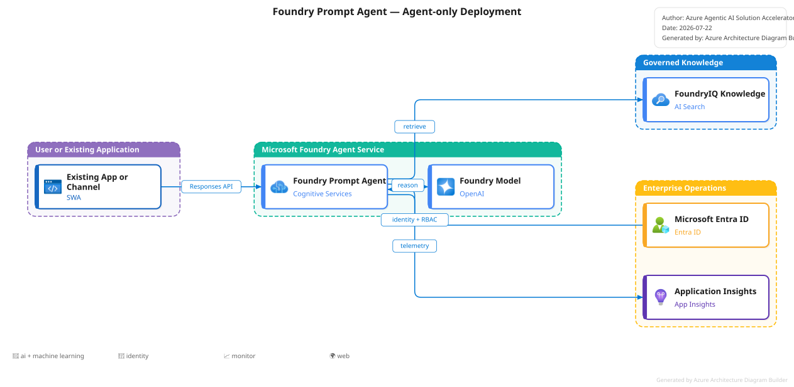
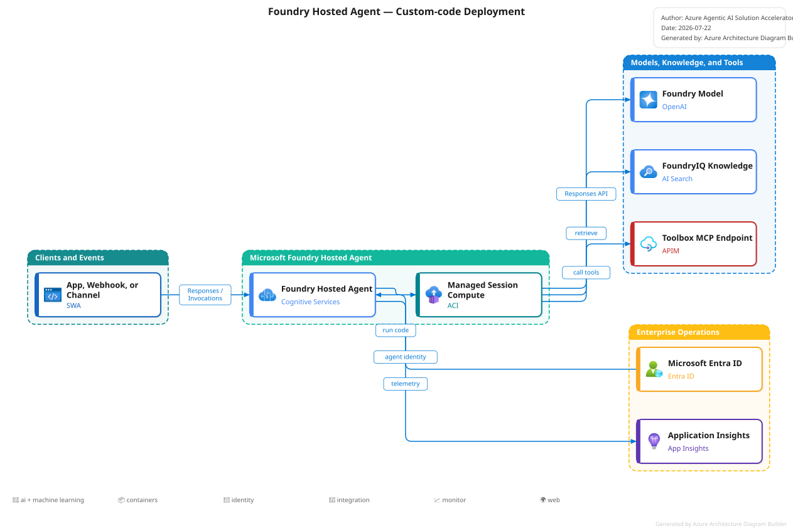

# Architecture Advisor

The Architecture Advisor turns approved discovery intent into a reviewed
Foundry and application architecture decision before scaffolding begins.

```powershell
accel design
```

The command is deterministic: it evaluates the approved solution brief and
approved requirement statements, reports matched signals, compares
alternatives, and proposes five independent decisions:

When the local evidence ledger contains approved requirements, export
`docs/discovery/requirements-traceability.md` before design. The fingerprint
uses that sanitized committed artifact so CI and other engineers calculate the
same result without access to private source excerpts.
Re-export whenever approved/rejected/deferred requirement decisions change;
`accel design` blocks if the committed statements do not match the local
approved set. Evidence references and implementation/evaluation links do not
change the fingerprint.

| Dimension | Values |
|---|---|
| Foundry agent type | `prompt-agent` · `hosted-agent` |
| Implementation pattern | `managed-prompt` · `harness` · `custom-workflow` |
| Orchestration pattern | `single-agent` · `deterministic-workflow` · `supervisor-routing` |
| Application shell | `none` · `existing-app` · `workbench` · `custom` |
| Accelerator deployment target | `foundry-prompt` · `hosted-preview` · `selfhost` |

!!! important "Workflow is not a third Agent Service runtime type"
    Microsoft Foundry Agent Service documents two main types: prompt agents and
    Hosted agents. A workflow describes control flow. Deterministic workflows
    and supervisor routing require custom orchestration code and therefore map
    to a Hosted agent or the self-hosted application target.

!!! important "Harness is an implementation pattern"
    Harness is the stable Agent Framework batteries-included runtime for a
    Hosted `single-agent` decision. It supplies planning, per-service-call
    history, todo/mode providers, context management hooks, and OpenTelemetry.
    It is neither a third Foundry agent type nor a replacement for deterministic
    workflow or supervisor orchestration.

The shipped flagship's advisor recommendation is Hosted, but its approved
template decision and `default_env` remain `selfhost` because the accelerator's
Hosted protocol/toolchain dependencies are still preview-gated.

## Review and approval

Accept the recommendation:

```powershell
accel design --approved-by "<partner architect>" --apply
```

Override one or more dimensions:

```powershell
accel design `
  --agent-type hosted-agent `
  --implementation-pattern custom-workflow `
  --orchestration-pattern supervisor-routing `
  --application-shell workbench `
  --deployment-target selfhost `
  --override-reason "<customer or platform constraint>" `
  --approved-by "<partner architect>" `
  --apply
```

An override without a reason fails closed. The decision is recorded in
`accelerator.yaml -> architecture`, including:

- the original recommendation and confidence
- matched requirement signals
- alternatives and rejection rationale
- the approved selection
- approver, timestamp, and override reason
- a requirements fingerprint

If the approved brief or requirement set changes, the fingerprint changes and
`accel next` returns to the design stage.

!!! note "One-time fingerprint migration"
    Engagements approved before the stable statement-only fingerprint was
    introduced may return to Design once after upgrading. Review `accel design`
    and re-approve with
    `accel design --approved-by "<partner architect>" --apply`; evidence and
    implementation links will no longer invalidate later approvals.

!!! note "Legacy hosted single-agent decisions"
    A pre-Harness manifest that lacks `implementation_pattern` remains
    `custom-workflow` at runtime for backward compatibility. Re-run and approve
    `accel design` to opt into Harness explicitly; upgrades never silently
    reclassify an existing runtime.

The application runtime also validates that the architecture is approved and
that `scenario.implementation` matches the recorded decision. Invalid or stale
manifests fail startup with an actionable `accel design` remediation instead of
serving an unapproved implementation.

## Recommendation model

| Requirement signal | Typical recommendation |
|---|---|
| Simple FAQ, knowledge assistant, summarization, managed tools, no custom runtime | Prompt agent + single agent |
| Adaptive autonomous single-agent work with planning, todos, in-run history, and custom tools | Hosted agent + Harness |
| Existing LangGraph/custom framework or dependencies | Hosted agent + custom workflow |
| Durable cross-request session state or persistent files | Hosted agent + custom workflow |
| Custom protocol, webhook payload, or voice surface | Hosted agent |
| Deterministic branching, retries, approvals, or ordered steps | Hosted agent + deterministic workflow |
| Multiple specialists, delegation, or supervisor aggregation | Hosted agent + supervisor routing |
| No application UI; another system calls the agent | `none` |
| Existing portal or customer application | `existing-app` |
| Structured input and report UX | `workbench` |
| Customer-specific UX/auth/state requirements | `custom` |

Side-effect tools are a Hosted/self-host signal because they must pass through
the accelerator's in-process `hitl.checkpoint(...)` boundary.

Harness scaffolds currently start with `retrieval: none` and no runtime tools.
Built-in web search, file memory/access, background agents, looping, shell, and
framework auto-approval are disabled by the accelerator's safe default.
Partners add governed tools deliberately; side effects still require
`hitl.checkpoint(...)`.

## Harness implementation

`src/workflow/harness.py` wraps `FoundryChatClient` with
`create_harness_agent`. Each HTTP request receives a fresh `AgentSession`, while
the stable Harness core supplies function invocation, in-run history,
todo/plan-mode providers, and OpenTelemetry. Repo-owned domain instructions are
loaded from `docs/agent-specs/<name>.md`; Python contains only the request
envelope. While a Harness run is active, the workflow emits protocol heartbeats;
closing a disconnected SSE stream cancels the in-flight Agent Framework task.

Harness skips Foundry prompt-agent version provisioning because it invokes the
model deployment directly. Model and platform provisioning remain shared.

## Target comparison

The following diagram was generated with the
[Azure Architecture Diagram Builder MCP](https://techcommunity.microsoft.com/blog/azurearchitectureblog/beyond-the-canvas-the-azure-architecture-diagram-builder-becomes-agent-ready/4534590)
using its deterministic `render_diagram` tool.
See [diagram provenance](../assets/diagrams/README.md).

<div class="architecture-diagram">
  
</div>

## Prompt-agent target

`foundry-prompt` provisions the Foundry project, models, prompt-agent versions,
FoundryIQ/Search, RBAC, monitoring, and readback checks. It does **not** deploy Container
Apps, ACR, or custom runtime code.

<div class="architecture-diagram">
  
</div>

## Hosted-agent target

`hosted-preview` deploys custom Agent Framework or other supported agent code
with Foundry-managed endpoint, session compute, identity, scaling, and
observability. The platform capability is documented by Foundry, while this
accelerator keeps its target preview-gated until its pinned azd extensions and
protocol packages leave prerelease.

<div class="architecture-diagram">
  
</div>

## References

- [Foundry Agent Service overview](https://learn.microsoft.com/azure/foundry/agents/overview)
- [Hosted agents in Foundry Agent Service](https://learn.microsoft.com/azure/foundry/agents/concepts/hosted-agents)
- [Microsoft Agent Framework Harness release](https://devblogs.microsoft.com/agent-framework/the-microsoft-agent-framework-harness-is-now-released/)
- [Engagement artifact authority](artifact-model.md)
- [Accelerator CLI reference](accelerator-cli.md)
