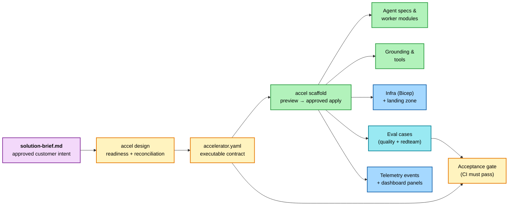

# 6. Scaffold from the brief

*Step 6 of 10 · Deliver to a customer*

!!! info "Step at a glance"
    **🎯 Goal** — Translate the brief into code, infra, evals, telemetry.

    **📋 Prerequisite** — [5. Discover with the customer](02-discover-with-the-customer.md) complete — `docs/discovery/solution-brief.md` has zero `TBD`.

    **💻 Where you'll work** — Terminal for deterministic commands; your
    coding-agent client and editor for specialist authoring and diff review.

    **✅ Done when** — `accel design` passes; the scaffold preview was approved
    and applied; specialist authoring is complete; `accel validate --full
    --execute` passes.

!!! tip "Specialists used after the CLI scaffold"
    [`/define-grounding`](../../../.github/agents/define-grounding.agent.md) →
    [`/implement-workers`](../../../.github/agents/implement-workers.agent.md)

    `accel scaffold` lays down the structural shape. `/define-grounding` wires
    FoundryIQ + AI Search indexes + catalog-tool declarations. `/implement-workers`
    fills every worker's three-layer module and Foundry spec. The legacy
    `/scaffold-from-brief` prompt remains a compatibility entry point.

    Full reference: [Custom agents overview](../../agents-index.md).

    These agents remain conversational specialists. `accel` owns readiness,
    preview/apply behavior, lifecycle state, and validation.

??? success "What success looks like"
    `git status` after the scaffold run shows changes spread across (typical):

    ```
    modified:   src/scenarios/sales_research/agents/supervisor/prompt.py
    modified:   src/scenarios/sales_research/retrieval.py
    new file:   src/tools/<your-new-tool>.py
    modified:   accelerator.yaml
    modified:   evals/quality/golden_cases.jsonl
    modified:   evals/redteam/<scenario>.jsonl
    modified:   infra/main.parameters.json
    ```

    `accel validate --full --execute` finishes successfully with no policy,
    test, lint, or type failures.

---

Start with deterministic design and scaffold commands:

```powershell
accel design
accel scaffold --scenario-id <scenario-id> --dry-run
accel scaffold --scenario-id <scenario-id> --apply
```

The dry run lists every file and the exact `accelerator.yaml` change. Applying
is transactional: a manifest-write failure rolls back newly generated files.
The **Lands in** column below shows flagship paths.

For a new scenario, substitute its package id for `sales_research` in the
`src/scenarios/<...>/` paths. Everything outside `src/scenarios/` remains
scenario-agnostic.

| Brief field → | Lands in (flagship paths shown; `src/scenarios/<id>/` for custom scenarios) |
|---|---|
| Problem + persona | `docs/agent-specs/<supervisor>.md` system instructions |
| Request/response UX contract | Scenario `request_schema`, `response_schema`, and `experience` metadata in `accelerator.yaml` |
| Solution shape | Keep flagship OR run `/switch-to-variant` for a walkthrough of re-authoring under `patterns/single-agent` or `patterns/chat-with-actioning` (manual re-authoring walkthroughs, not drop-ins) |
| Grounding sources | `scenario.agents[].retrieval` (`foundry_tool` or `none`) + scenario index schema + `scenario.retrieval.indexes[]` |
| Side-effect tools | New files under `src/tools/` with HITL scaffolding |
| HITL gates | Per-tool `HITL_POLICY` constant + `checkpoint(...)` calls; `accelerator.yaml -> solution.hitl` engagement-level summary |
| Constraints | `infra/main.parameters.json` + `accelerator.yaml` |
| Success criteria | `evals/quality/golden_cases.jsonl` — scaffolder seeds stub `q-001` so lint stays green; you refine `query` + `expected` to encode the real customer success criteria + CI gates |
| RAI risks | `evals/redteam/` custom adversarial cases |
| ROI KPIs | `src/accelerator_baseline/telemetry.py` events + `infra/dashboards/roi-kpis.json` (panels are scenario-agnostic; rename the dashboard per engagement) |



`accel scaffold` is initial materialization and refuses to overwrite an
existing scenario. Later brief changes are reviewed implementation diffs;
specialist agents may update prompts, workers, tools, grounding, evals, and
telemetry without re-scaffolding.

## Wire grounding & implement workers

`accel scaffold` materialises the **structural** shape — folders, stub
three-layer files, and manifest update. Two specialist agents turn the stubs
into a working scenario:

```
/define-grounding
```

…declaratively wires each worker to its facts source. Two grounding modes:
`foundry_tool` (FoundryIQ KB; AI Search lives underneath) and `none`
(transformational workers). It also records governed portal catalog-tool
intent. Shared provisioning creates Knowledge Sources, KBs, and managed agent
attachments on the next target-aware deployment.

```
/implement-workers
```

…walks the supervisor DAG in dependency order and invokes `/implement-worker` for each scaffolded-but-unfinished worker. It fills `prompt.py`, `transform.py`, `validate.py`, and the Foundry agent spec (`docs/agent-specs/<foundry_name>.md`) from the brief, the manifest, and the worker's `capability` declaration. Use `/implement-worker <worker_id>` for a single worker — same code path, narrower scope.

After both have run, the scenario has real prompts, real validators, real grounding wiring, and a green lint — but the eval `query`/`expected` pairs are still TODOs. That's the next step.

## Authoring agent instructions

Agent system instructions live in `docs/agent-specs/<agent>.md` under
`## Instructions` — edit those Markdown files, not Python. Shared provisioning
syncs them during deployment. `prompt.py` is for *per-request* input only.

## Review the diff

Open VS Code's **Source Control** panel (`Ctrl+Shift+G`) or run:

```powershell
accel review
accel validate --full --execute
```

The policy gate covers manifest shape, models, response metadata, content
filters, HITL, data governance, skill synchronization, deployment targeting,
workflow secrets, and documentation integrity. CI re-runs the same contract.

If the lint flags anything, fix it now — every later step assumes the lint is green.

---

**Continue →** [7. Provision the customer's Azure](04-provision-the-customers-azure.md)
