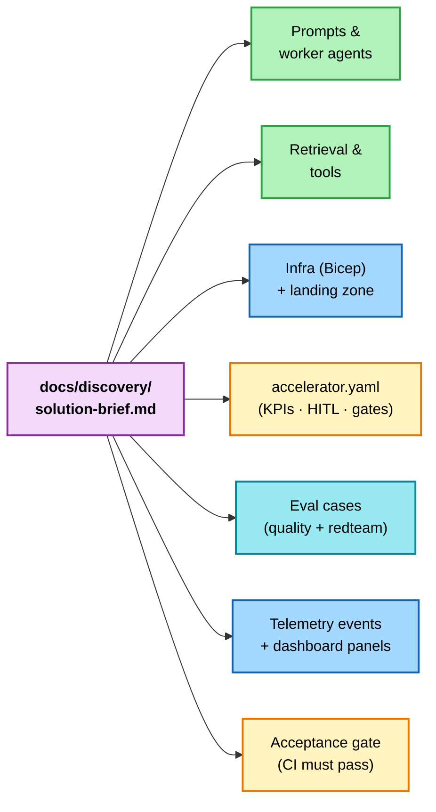

# 6. Scaffold from the brief

*Step 6 of 10 · Deliver to a customer*

!!! info "Step at a glance"
    **🎯 Goal** — Translate the brief into code, infra, evals, telemetry.

    **📋 Prerequisite** — [5. Discover with the customer](02-discover-with-the-customer.md) complete — `docs/discovery/solution-brief.md` has zero `TBD`.

    **💻 Where you'll work** — VS Code (Copilot Chat sidebar + Source Control panel for diff review).

    **✅ Done when** — `/scaffold-from-brief` has run; the diff is reviewed and committed; `python scripts/accelerator-lint.py` passes.

!!! tip "Custom agents used here"
    [`/scaffold-from-brief`](../../../.github/agents/scaffold-from-brief.agent.md) → [`/define-grounding`](../../../.github/agents/define-grounding.agent.md) → [`/implement-workers`](../../../.github/agents/implement-workers.agent.md)

    Run them in that order. `/scaffold-from-brief` lays down the structural shape (folders, stub three-layer files, manifest skeleton). `/define-grounding` wires FoundryIQ + AI Search indexes + catalog tools into each worker declaratively. `/implement-workers` walks the supervisor DAG and fills every stub `prompt.py` / `transform.py` / `validate.py` + Foundry agent spec in dependency order.

    Full reference: [Custom agents overview](../../agents-index.md).

??? success "What success looks like"
    `git status` after the scaffold run shows changes spread across (typical):

    ```
    modified:   src/scenarios/sales_research/agents/supervisor/prompt.py
    modified:   src/scenarios/sales_research/retrieval.py
    new file:   src/tools/<your-new-tool>.py
    modified:   accelerator.yaml
    modified:   evals/quality/golden_cases.jsonl
    modified:   evals/redteam/<scenario>.jsonl
    modified:   infra/main.parameters.json
    ```

    `python scripts/accelerator-lint.py` finishes with:

    ```
    ✅ accelerator-lint: 30/30 rules passed
    ```

---

In Copilot Chat:

```
/scaffold-from-brief
```

Copilot reads the filled brief and customises the repo. The **Lands in** column below shows paths for the flagship scenario (`sales-research`).

If you scaffold a **new** scenario via `python scripts/scaffold-scenario.py <scenario-id>` (e.g., `customer-service`, `rfp-response`), substitute `<scenario-id>` for `sales_research` in the `src/scenarios/<...>/` paths. Everything outside `src/scenarios/` is scenario-agnostic and stays put.

| Brief field → | Lands in (flagship paths shown; `src/scenarios/<id>/` for custom scenarios) |
|---|---|
| Problem + persona | `src/scenarios/sales_research/agents/supervisor/prompt.py` system prompt |
| Solution shape | Keep flagship OR run `/switch-to-variant` for a walkthrough of re-authoring under `patterns/single-agent` or `patterns/chat-with-actioning` (manual re-authoring walkthroughs, not drop-ins) |
| Grounding sources | `src/retrieval/ai_search.py` (scenario-agnostic client) + scenario-specific index schema at `src/scenarios/sales_research/retrieval.py` + `infra/modules/ai-search.bicep` |
| Side-effect tools | New files under `src/tools/` with HITL scaffolding |
| HITL gates | Per-tool `HITL_POLICY` constant + `checkpoint(...)` calls; `accelerator.yaml -> solution.hitl` engagement-level summary |
| Constraints | `infra/main.parameters.json` + `accelerator.yaml` |
| Success criteria | `evals/quality/golden_cases.jsonl` — scaffolder seeds stub `q-001` so lint stays green; you refine `query` + `expected` to encode the real customer success criteria + CI gates |
| RAI risks | `evals/redteam/` custom adversarial cases |
| ROI KPIs | `src/accelerator_baseline/telemetry.py` events + `infra/dashboards/roi-kpis.json` (panels are scenario-agnostic; rename the dashboard per engagement) |



Re-run `/scaffold-from-brief` whenever the brief changes — the same expansion reapplies across every artefact.

## Wire grounding & implement workers

`/scaffold-from-brief` only materialises the **structural** shape — folders, stub three-layer files, manifest skeleton. Two follow-up custom agents turn the stubs into a working scenario, and they're the natural next steps before you commit:

```
/define-grounding
```

…declaratively wires each worker to its facts source. Two grounding modes: `foundry_tool` (FoundryIQ Knowledge Base — start here for any worker that makes factual claims; AI Search lives underneath FoundryIQ) and `none` (purely transformational workers — routers, formatters, aggregators). It also lets you list any Foundry portal **catalog tools** each worker should call. Output: a fully populated `scenario.agents[]` block plus matching `scenario.retrieval.indexes[]` entries, all validated by lint. No Python written; the startup bootstrap (`src/bootstrap.py`) provisions FoundryIQ Knowledge Sources + Knowledge Bases + agent attachments on the next `azd deploy`.

```
/implement-workers
```

…walks the supervisor DAG in dependency order and invokes `/implement-worker` for each scaffolded-but-unfinished worker. It fills `prompt.py`, `transform.py`, `validate.py`, and the Foundry agent spec (`docs/agent-specs/<foundry_name>.md`) from the brief, the manifest, and the worker's `capability` declaration. Use `/implement-worker <worker_id>` for a single worker — same code path, narrower scope.

After both have run, the scenario has real prompts, real validators, real grounding wiring, and a green lint — but the eval `query`/`expected` pairs are still TODOs. That's the next step.

## Authoring agent instructions

Agent system instructions live in `docs/agent-specs/<agent>.md` under the `## Instructions` heading — edit those Markdown files, not Python. On `azd up` (next step), the FastAPI startup bootstrap (`src/bootstrap.py`) syncs each spec verbatim to the Foundry portal once the Container App boots. `prompt.py` is for *per-request* input construction only.

## Review the diff

Open VS Code's **Source Control** panel (`Ctrl+Shift+G`). Walk every changed file. Then:

```bash
git add -A
git commit -m "Scaffold from brief"
python scripts/accelerator-lint.py
```

The lint runs **30 deterministic rules** against `accelerator.yaml` + repo state — manifest shape, per-agent model references, content-filter attachment, HITL coverage on side-effect tools, workflow secrets documented, deploy chain gating, and more. CI re-runs it on every PR, but running it locally first saves a round-trip.

If the lint flags anything, fix it now — every later step assumes the lint is green.

---

**Continue →** [7. Provision the customer's Azure](04-provision-the-customers-azure.md)
