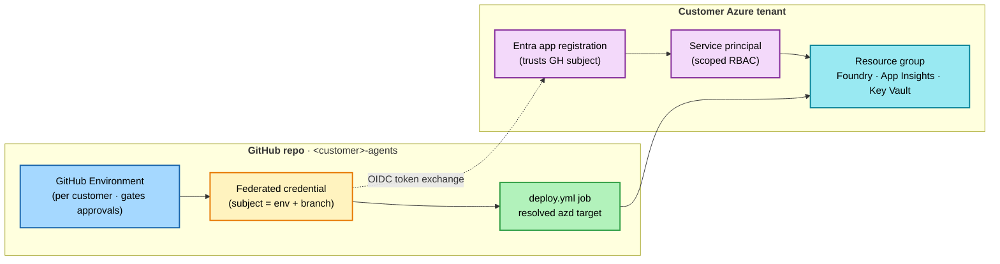

# 7. Provision the customer's Azure

*Step 7 of 10 · Deliver to a customer*

!!! info "Step at a glance"
    **🎯 Goal** — Stand up the declared self-hosted or Hosted preview target
    through `accel deploy`, against a GitHub Environment that holds the
    customer's OIDC credentials.

    **📋 Prerequisite** — [6. Decide and scaffold](03-scaffold-from-the-brief.md) complete — architecture approved, lint green, brief committed.

    **💻 Where you'll work** — local terminal for `accel environment/deploy`;
    specialist agents and GitHub web for landing-zone, OIDC, and Environment
    registration; Azure portal for post-deploy inspection.

    **✅ Done when** — Resources exist; the self-host `/healthz` + scenario
    smoke or Hosted fresh-session Responses smoke passes; Foundry and monitoring
    are reachable; required HITL wiring is configured.

!!! tip "Custom agents used here"
    [`/configure-landing-zone`](../../../.github/agents/configure-landing-zone.agent.md) · [`/deploy-to-env`](../../../.github/agents/deploy-to-env.agent.md)

    Full reference: [Custom agents overview](../../agents-index.md).

    After those customer-specific decisions, `accel environment list` and
    `accel deploy` are the authoritative preflight/execution path.

??? success "What success looks like"
    A self-host deployment ends with a summary like:

    ```
    SUCCESS: Your application was provisioned and deployed to Azure in 12m 4s.
    You can view the resources created under the resource group rg-<customer>-dev in:
    https://portal.azure.com/...
    Endpoint: https://<api>.<region>.azurecontainerapps.io
    ```

    `curl <api-url>/healthz` returns:

    ```json
    {"status": "ok", "scenario": "<scenario-id>"}
    ```

    The customer's resource group lists at least: AIServices account · model deployment · Foundry project · Container App · App Insights · Log Analytics · AI Search · Key Vault · User-Assigned MI.

!!! tip "Smoke test before you move on"
    For self-host, `/healthz` proves only that the container is alive. Run:

    ```bash
    python evals/quality/run.py --api-url <api-url> --smoke
    ```

    This runs representative SSE cases. Hosted preview instead uses the
    fresh-session Responses protocol smoke built into its deployment path; full
    hosted acceptance adaptation remains deferred.

---

This step combines specialist setup for landing zone/OIDC with a deterministic
deployment preview and explicit Azure execution approval.

## Preflight: pick a landing-zone tier

```
/configure-landing-zone
```

The custom agent walks the partner through three tiers:

- **Tier 1 — `standalone`** — single-RG, public endpoints, Entra-only. For pilots and SMB.
- **Tier 2 — `avm`** — Azure Verified Modules + private endpoints + private DNS. For mid-market.
- **Tier 3 — `alz-integrated`** — overlays the customer's existing AI ALZ hub via `infra/alz-overlay/`. For regulated / enterprise.

Tier choice writes to `accelerator.yaml -> landing_zone.mode` and selects the matching `infra/` shape. The lint rule `landing_zone_mode_consistent` enforces the match.

For regulated customers: set `controls.private_endpoints = required` (implies Tier 2 or Tier 3).

→ Detail: [Reference → Architecture & governance → Azure AI landing zone](../../patterns/azure-ai-landing-zone/README.md).

!!! tip "Walk the security review checklist with the customer's CCoE before deployment"
    [Reference → Security review checklist](../../references/security-review-checklist.md) is a 6-section walkthrough designed for the customer's security reviewer. Most items are pre-satisfied by the accelerator; the remaining rotation, location, and break-glass decisions belong in the handover packet. Complete it before deployment to avoid re-cutting the environment.

    For Tier 3 (`alz-integrated`) specifically, also run `python scripts/validate-alz.py` after filling `infra/alz-overlay/main.parameters.json` — it catches unfilled placeholders and unreachable hub resource IDs before they fail mid-deploy.

## Preflight: register the customer environment

```
/deploy-to-env <env-name>      # e.g., dev, uat, prod
```

The custom agent adds an entry to `deploy/environments.yaml`, creates the matching **GitHub Environment**, wires the OIDC federated credential between the customer's Entra app registration and the GitHub Environment, scopes the per-environment secrets (`AZURE_CLIENT_ID` / `AZURE_TENANT_ID` / `AZURE_SUBSCRIPTION_ID`) and variable (`AZURE_LOCATION`), and dispatches a first deploy.

Choose the target recorded by `accel design`; deployment blocks if the
environment and architecture decision disagree.

!!! warning "Never hand-edit `deploy.yml` to add envs"
    The manifest + the `resolve-env` job is the contract; the `deploy_matrix_matches_azure_envs` lint rule rejects drift. The azd environment name is **always** derived from `deploy/environments.yaml` — never set `vars.AZURE_ENV_NAME`.

If the environment will gate side-effect tools through a webhook approver (Logic Apps, Teams, ServiceNow), set `HITL_APPROVER_ENDPOINT` as an Environment secret on the same screen. Failures to reach the approver are treated as rejections (fail-closed).



At handover, the federated credential is re-pointed to the customer's own repo — never hand-edit `deploy.yml`; `deploy/environments.yaml` is the contract.

## Provision + deploy

```bash
# Replace <customer-tenant-id> with the customer's Azure tenant GUID, and
# <customer-short-name> with the customer's short name (e.g., contoso)
az login --tenant <customer-tenant-id>
azd auth login
accel environment list
```

Preview, preflight, then execute:

```powershell
accel deploy --env <environment-name> --region <region> --dry-run
accel deploy --env <environment-name> --region <region> --execute
accel deploy --env <environment-name> --region <region> --execute --apply
```

The first command is read-only. The second runs Azure preflight checks. The
third executes only after a separate approval. `deployment_target` always comes
from `deploy/environments.yaml`; a conflicting CLI override is rejected.

Target behavior:

| Target | What apply does |
|---|---|
| `foundry-prompt` | Provisions Foundry, models, Search/FoundryIQ, prompt agents, RBAC, monitoring, and readback checks—no application runtime |
| `hosted-preview` | Runs nested `azd provision` then `azd deploy` for custom agent code |
| `selfhost` | Runs root `azd up` for Container Apps API, Key Vault, ACR, Foundry, Search, and monitoring |

The environment target must match the approved Architecture Advisor decision.
Direct `azd` commands are recovery paths, not the guided path.

The self-host `azd up` path provisions, in ~10–15 minutes:

- Cognitive Services account (`kind=AIServices`, GA)
- Default content filter (`accelerator-default-policy`) blocking Medium+ on Hate/Sexual/Violence/Selfharm
- Model deployment (default `gpt-5-mini`, `GlobalStandard`, 30 TPM) bound to the content filter
- Foundry project (`accelerator-default`)
- Azure AI Search · Key Vault (RBAC) · Container App · Log Analytics + App Insights
- User-assigned managed identity with Cognitive Services OpenAI User + Azure AI Developer roles

The deployed API URL prints at the end — keep it; the next step uses it.

## Confirm a self-host deploy is healthy

```bash
# Replace <api-url> with the URL the deployment printed
curl <api-url>/healthz
```

200 = the scenario process is healthy. Confirm the real agent path with the
smoke evaluation; health alone does not prove grounding or agent provisioning.

If `/healthz` returns 503, the FastAPI startup bootstrap is failing — most often RBAC propagation lag (1–3 minutes). Watch in App Insights:

```kusto
traces | where operation_Name == "lifespan.startup"
```

## Troubleshooting deployment and first boot

Customer deploys hit a small set of repeatable failure modes. Try these in
order before re-running the approved `accel deploy` flow. For other symptoms
see the [troubleshooting cookbook](../../references/troubleshooting.md).

??? failure "RBAC role hasn't propagated yet (most common)"
    **Symptom.** `/healthz` returns 503; App Insights `traces` show `Forbidden` from Cognitive Services or AI Search during `lifespan.startup`.

    **Cause.** Managed Identity role assignments take 1–3 minutes to propagate after `azd up` finishes.

    **Fix.** Wait 3 minutes, hit `/healthz` again. If still failing, confirm the User-Assigned MI has **Cognitive Services OpenAI User** + **Azure AI Developer** + **Search Index Data Contributor** in the resource group:

    ```bash
    az role assignment list --assignee <mi-principal-id> --scope <rg-id> -o table
    ```

??? failure "Model deployment quota exceeded in the chosen region"
    **Symptom.** `azd up` fails inside `Microsoft.CognitiveServices/accounts/deployments` with `InsufficientQuota` or `429`.

    **Cause.** The default model (`gpt-5-mini` GlobalStandard, 30 TPM) competes with other deployments in the region.

    **Fix.** Request quota, choose a region with headroom, or reduce
    `accelerator.yaml.models[].capacity`, then re-run the approved deploy flow.

??? failure "Foundry project failed to create"
    **Symptom.** `azd up` fails on `Microsoft.CognitiveServices/accounts/projects` resource.

    **Cause.** Either the AIServices account is not fully provisioned, or the
    subscription/region is not enabled for Microsoft Foundry projects.

    **Fix.** Re-run the approved deploy flow (idempotent). If it fails twice,
    confirm the AIServices account/project state in Foundry and inspect the
    deployment diagnostics; do not create an unmanaged parallel project.

??? failure "AI Search index never seeded"
    **Symptom.** `/healthz` returns 200, but agent calls fail with `ResourceNotFound` for the search index, or eval cases get `0` retrieval hits.

    **Cause.** The bootstrap ran before AI Search RBAC propagated, so the seed step was skipped.

    **Fix.** Restart the Container App revision (`az containerapp revision restart` or hit the **Restart** button in the portal). The startup bootstrap re-runs the seed step; verify with:

    ```kusto
    traces | where message contains "ai-search seed" | order by timestamp desc
    ```

??? failure "HITL approver endpoint not reachable"
    **Symptom.** Side-effect tools fail-closed; logs show `hitl.checkpoint -> approver_unreachable`.

    **Cause.** `HITL_APPROVER_ENDPOINT` Environment secret was not set when `/deploy-to-env` ran, or the URL points to an approver Logic App / webhook that isn't deployed yet.

    **Fix.** Set the secret in **GitHub → Settings → Environments → \<env-name\> → Add secret**, then `azd deploy` to roll the new value into the Container App config. Test with a contrived side-effect call from a unit test — fail-closed is by design and correct.

??? failure "Anything else"
    Capture App Insights traces for the failing operation:

    ```kusto
    union exceptions, traces
    | where timestamp > ago(15m) and severityLevel >= 2
    | order by timestamp desc
    ```

    For per-machine prerequisites that look broken (Python, gh, az, azd), see the Get-ready troubleshooting in [2. Set up your machine](../ready/02-set-up-your-machine.md#troubleshooting--top-5-per-machine).

!!! note "When the engagement ends"
    Decommissioning a deployed environment isn't `azd down` alone. Cognitive Services accounts and Key Vaults survive `--purge` in soft-delete and block re-creation in the same name+region. Run `/teardown` (or `python scripts/teardown-preflight.py --env <name>`) at engagement end — it walks the pre-teardown checklist and the post-teardown soft-delete sweep. Full reference: [Customer runbook → Re-provisioning and rollback](../../customer-runbook.md#azd-down---purge).

---

**Continue →** [8. Iterate & evaluate](05-iterate-and-evaluate.md)
